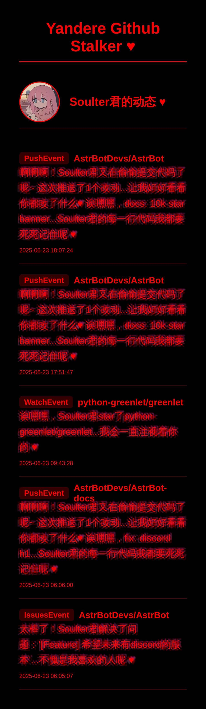

<div align="center">

# Yandere Github Stalker Plugin - 病娇版

[](https://github.com/SXP-Simon/astrbot_plugin_yandere_github_stalker)
[](https://github.com/AstrBotDevs/AstrBot)
[](LICENSE)

_✨ 用于监控 GitHub 用户活动的 AstrBot 插件，采用病娇风格的通知方式。它可以实时追踪指定用户的 GitHub 活动，并通过图片或文本的形式发送通知。 ✨_


    </div>

---

## ✨ 功能特点

- 实时监控多个 GitHub 用户的活动
- 病娇风格的活动通知
- 支持多种活动类型的识别和展示
- 提供《精美的图片》通知和简洁的文本通知
- 可配置的检查间隔和通知方式
- 支持自定义病娇风格模板
- 支持 GitHub API Token 以提高 API 访问限制


## ⚙️ 配置

在 AstrBot 的配置文件中添加以下配置（示例）：

```json
{
    "monitored_users": ["用户名1", "用户名2"],
    "target_sessions": ["会话ID1", "会话ID2"],
    "check_interval": 300,
    "github_token": "your_github_token",
    "enable_image_notification": true,
    "monitor_push": {
        "enabled": true,
        "template": "哼！{username}君又在写代码了呢...让我看看你写了什么 ♥",
        "commit_message": "啊...{message}...{username}君的代码真是太棒了呢 ♥"
    },
    "monitor_issues": {
        "enabled": true,
        "opened": "呀！{username}君发现了新的问题呢：'{title}'...让我也来帮你解决吧 ♥",
        "closed": "太棒了！{username}君解决了问题：'{title}'...不愧是我喜欢的人呢 ♥"
    }
}
```

### 📝 配置说明

1. `monitored_users`: 要监控的GitHub用户名列表
2. `target_sessions`: 接收通知的会话ID列表（格式：`平台:ID:类型`）
3. `check_interval`: 检查间隔（秒）
4. `github_token`: GitHub API Token（可选，但建议配置）
5. `enable_image_notification`: 是否启用图片通知
6. `monitor_*`: 各类事件的监控配置
   - `enabled`: 是否启用该类事件监控
   - 其他字段为该事件类型的模板配置

### 📝 支持的事件类型

- `monitor_push`: 推送事件
- `monitor_issues`: Issue事件
- `monitor_pull_request`: PR事件
- `monitor_star`: Star事件（实际为WatchEvent）
- `monitor_fork`: Fork事件
- `monitor_create`: 创建分支/标签事件
- `monitor_delete`: 删除分支/标签事件
- `monitor_public`: 仓库公开事件
- `monitor_member`: 成员变动事件
- `monitor_commit_comment`: 提交评论事件

### 📝 模板变量

在自定义模板中可以使用以下变量：

- 所有事件通用：
  - `{username}`: GitHub用户名
  - `{repo}`: 仓库名称

- PushEvent：
  - `{commit_count}`: 提交数量
  - `{message}`: 提交消息（在commit_message模板中使用）

- CreateEvent/DeleteEvent：
  - `{ref_type}`: 创建/删除的类型（branch/tag等）
  - `{ref}`: 具体的名称

- IssuesEvent/PullRequestEvent：
  - `{title}`: Issue/PR的标题
  - `{action}`: 动作类型（opened/closed等）

## ✨ 可用命令

- **`yandere test`**: 测试 GitHub 活动通知图片生成。(以 test_data.json 为示例数据)
- **`yandere status`**: 显示当前监控状态。
- **`yandere add <username>`**: 添加一个 GitHub 用户到监控列表。
- **`yandere remove <username>`**: 从监控列表中移除一个 GitHub 用户。
- **`yandere enable`**: 启用当前会话的通知（需要管理员权限）。
- **`yandere disable`**: 禁用当前会话的通知（需要管理员权限）。

## ✨ 通知示例

### 文本通知
```
啊啊啊！Soulter君又有新的动态了呢！♥

诶嘿嘿，Soulter君Fork了owner/repo...这样我就能看到更多Soulter君的代码了呢 ♥

还有更多动态...Soulter君真是太活跃了呢 ♥
```

### 图片通知
- 病娇主题图片通知
- 包含用户头像和详细活动信息
- 病娇风格的文字描述（可自定义模板）
- 示例：


## ❗ 注意事项

1. 建议配置 GitHub Token 以获得更高的 API 访问限制
2. 合理设置检查间隔，避免触发 GitHub API 限制
3. 会话ID格式必须为 `平台:ID:类型`，例如 `qq:123456:group`
4. 自定义模板时请确保包含所有必要的变量占位符

## 📂 文件结构

项目的主要文件和目录结构如下：

```
├── src/
│   ├── config_manager.py            # 配置管理
│   ├── event_processor.py           # 事件处理
│   ├── github_api.py                # GitHub API 交互逻辑
│   ├── github_event_data.py         # GitHub 事件数据结构
│   ├── notification_renderer.py     # 通知渲染逻辑
│   ├── notification_sender.py       # 通知发送逻辑
│   ├── pushed_event_id_manager.py   # 推送事件ID管理
│   ├── yandere_templates.py         # 病娇风格模板
│   └── templates/
│       └── notification.html        # HTML 通知模板
├── main.py                          # 插件主入口
├── requirements.txt                 # 项目依赖
├── README.md                        # 项目说明文档
├── metadata.yaml                    # 插件元数据
├── test_data.json                   # 测试数据
├── _conf_schema.json                # 配置schema
├── demo.jpg                         # 示例图片
├── __init__.py                      # 包初始化
└── __pycache__/                     # Python缓存
```


## 📜 贡献 PR

欢迎为本项目贡献代码！

